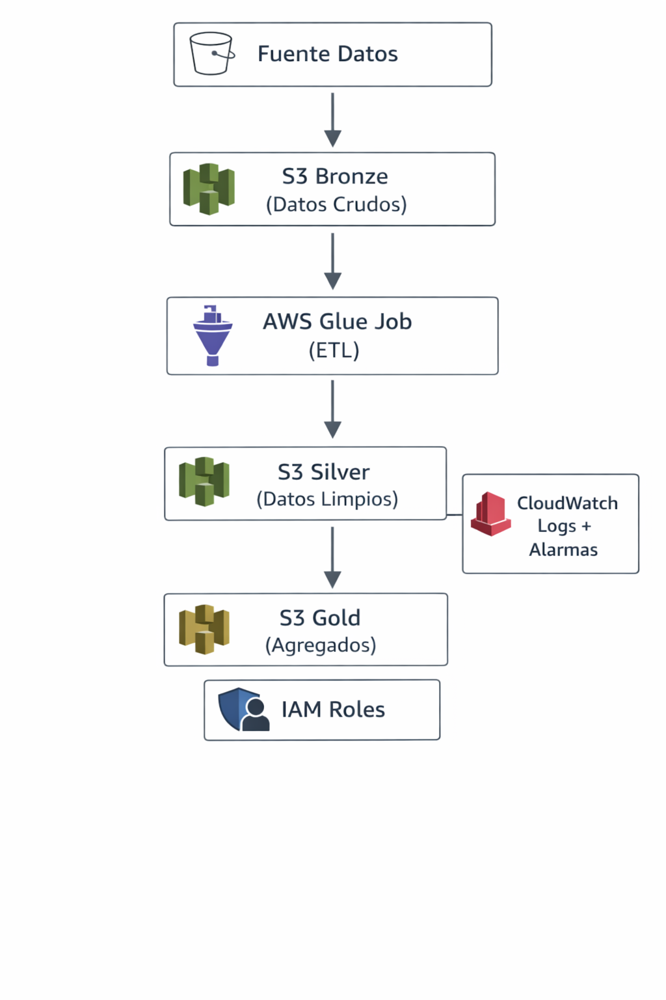

# Data Lake Simple con Terraform
---

# 1. Arquitectura General


---

# 2. Buckets: Bronze, Silver, Gold

## Archivo: modules/s3_lake/main.tf

```hcl
resource "aws_s3_bucket" "this" {
  bucket = "${var.project}-${var.env}-${var.bucket_name}-${var.account_id}"
  tags   = var.tags
}
```

### Línea por línea

- `resource "aws_s3_bucket"` → define un bucket
- `"this"` → nombre interno del recurso
- `bucket =` → nombre dinámico del bucket
- `${var.project}` → nombre del proyecto
- `${var.env}` → ambiente (dev, prod)
- `${var.bucket_name}` → bronze/silver/gold
- `${var.account_id}` → evita duplicados globales

Resultado:
```
datalake-dev-bronze-123456789
```

---

## Encriptación

```hcl
resource "aws_s3_bucket_server_side_encryption_configuration" "encryption" {
```

- Habilita cifrado en reposo
- `AES256` → estándar AWS

---

## Lifecycle

```hcl
transition {
  days          = 180
  storage_class = "STANDARD_IA"
}
```

- Después de 180 días → más barato
- Optimización de costos

---

# 3. Flujo de Datos entre Buckets

```
Bronze (raw CSV)
   ↓
Glue Job
   ↓
Silver (parquet limpio)
   ↓
(agregaciones futuras)
   ↓
Gold
```

---

# 4. Glue Job

## Archivo: modules/glue/main.tf

```hcl
resource "aws_glue_job" "sales_etl" {
```

### Explicación

- Define un job ETL administrado
- Usa Spark por debajo

---

### Parámetros clave

```hcl
role_arn = var.glue_role_arn
```

- Conecta con IAM
- Permisos para S3 y logs

---

```hcl
script_location = var.script_location
```

- Script ETL almacenado en S3

---

```hcl
"--input_path"  = "s3://${var.raw_bucket}/sales_small.csv"
"--output_path" = "s3://${var.staging_bucket}/sales/"
```

Aquí ocurre la conexión:

- Entrada → Bronze
- Salida → Silver

---

### Workers

```hcl
worker_type       = "G.1X"
number_of_workers = 2
```

- Define capacidad
- Controla costo

---

# 5. CloudWatch

## Archivo: modules/cloudwatch/main.tf

### Log Group

```hcl
name = "/aws-glue/jobs/${var.project}-${var.env}"
```

- Guarda logs del job

---

### Alarma

```hcl
metric_name = "glue.driver.aggregate.numFailedTasks"
threshold   = 0
```

- Si hay fallos → alerta

---

### Dashboard

- Métricas de éxito vs fallos
- Visualización operativa

---

# 6. IAM (Seguridad)

## Archivo: modules/iam/main.tf

---

## Rol

```hcl
resource "aws_iam_role" "glue_role"
```

- Define identidad de Glue

---

## Trust Policy

```hcl
Service = "glue.amazonaws.com"
```

- Permite a Glue asumir el rol

---

## Política S3

```hcl
Action = [
  "s3:GetObject",
  "s3:ListBucket"
]
```

- Leer Bronze

```hcl
"s3:PutObject"
```

- Escribir en Silver

---

## Política Logs

```hcl
logs:CreateLogGroup
logs:PutLogEvents
```

- Permite escribir logs

---

## Attachments

```hcl
aws_iam_role_policy_attachment
```

- Une políticas al rol

---

# 7. Variables y Conexiones

## Ejemplo

```hcl
variable "project" {}
```

---

## Flujo de variables

```
env/dev → variables.tf
   ↓
main.tf (root)
   ↓
modules (inputs)
   ↓
resources
```

---

## Outputs

Ejemplo:

```hcl
output "glue_role_arn"
```

Se usa en:

```
module.iam → output
module.glue → input
```

---

# 8. Cómo todo se conecta

```
IAM Role → Glue Job
Glue Job → S3 Bronze/Silver
CloudWatch → monitorea Glue
S3 → almacena datos
```

---

# 9. Flujo completo

1. Se crean buckets
2. Se crea IAM role
3. Glue usa ese rol
4. Job lee Bronze
5. Escribe Silver
6. CloudWatch monitorea

---

# 10. Despliegue

## Ubícate en el entorno correcto

Debes pararte en:

```bash
cd terraform/envs/dev
```

### Inicializar Terraform
```bash
terraform init
```

### Formatear código (buena práctica)
```bash
terraform fmt -recursive
```

### Validar configuración
```bash
terraform validate
```
Si algo está mal, aquí lo detectas antes de romper nada.

### Ver el plan
```bash
terraform plan -var-file="dev.tfvars"
```
Aquí debes ver:

- 3 buckets (bronze, silver, gold)
- IAM role
- Glue job
- CloudWatch
- Otros módulos definidos

### Aplicar infraestructura
```bash
terraform apply -var-file="dev.tfvars"
```
Te pedira confiramción (yes)

### Ver outputs
```bash
terraform output
```

### Subir archivos necesarios (MUY IMPORTANTE)

Terraform NO sube archivos automáticamente, así que debes hacerlo manualmente:

- Subir CSV (datos de entrada)
```bash
aws s3 cp sales_small.csv s3://TU-BUCKET-BRONZE/
```
- Subir script Glue
```bash
aws s3 cp scripts/etl_sales.py s3://TU-BUCKET-BRONZE/scripts/
```


---

# 11. Errores comunes

- Permisos IAM insuficientes
- Bucket names duplicados
- Script Glue mal ubicado

---

- Seguro
- Optimizado en costos

---
# 12. ¿Cómo borrar TODO? (equivalente a delete stack)

Terraform tiene un comando directo:
```bash
cd terraform/envs/dev
terraform destroy -var-file="dev.tfvars"
```
Qué hace

- Lee el state
- Identifica todos los recursos
- Los elimina en orden correcto

Te pedirá confirmación:

Do you really want to destroy all resources?(yes)

## Cosas IMPORTANTES antes de destruir
### 1. Buckets S3 NO vacíos

Error típico: BucketNotEmpty

#### Solución

Vaciar buckets primero:
aws s3 rm s3://TU-BUCKET --recursive

Hazlo para:

bronze
silver
gold

### 2. Glue Jobs en ejecución

Deben estar detenidos

### 3. Dependencias manuales

Si creaste cosas fuera de Terraform → no se borran

---
